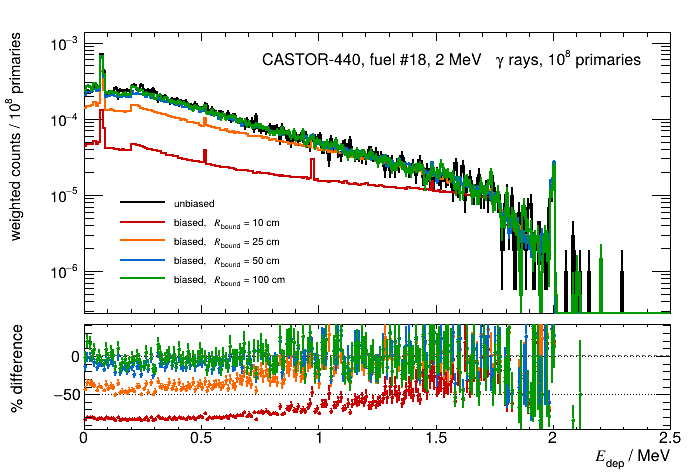
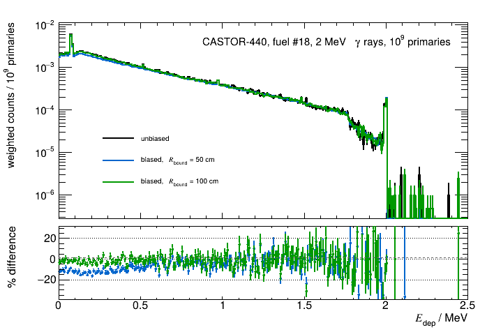

# Geometrical biasing example

## Gamma rays

Simulation macro/results which test the geometric biasing implementation for a 2 MeV gamma-ray source within a CASTOR fuel assembly (#18, closest to the CLYC). 
We compare 1e8/1e9 gamma rays emitted with either i) no directional bias, or ii) with a directional bias using a stated bounding radius which surrounds the CLYC detector (centered about the CLYC crystal center-of-mass). 
Deviations in the low-energy background can be seen for the smaller bounding radii, suggesting that a non-insignificant contribution to the low-energy background arises from gamma rays which are not emitted directly towards the CLYC detector, and instead arise from scattering within the cask. 
It appears that, for 2 MeV gammas, that $R_{\text{bound}}$ = 100 cm is acceptable (deviations from unbiased case on the order of 10% or less)

## Results

### 10$^{8}$ primaries

| $R_{\text{bound}}$ / cm | Net counts | Net counts ratio (to unbiased case) | Integral (weighted) | Integral (weighted) ratio (to unbiased case) |
| ----------------------- | ---------- | -------------------------------------- | ------------------- | ----------------------------------------------- |
| unbiased                | 18322      | -                                      | 0.0174732           | -                                               |
| 10                      | 1156680    | 63.1                                   | 0.00411719          | 0.23                                            | 
| 25                      | 507736     | 27.7                                   | 0.01142             | 0.65                                            |
| 50                      | 166243     | 9.1                                    | 0.0159861           | 0.91                                            |
| 100                     | 36922      | 2.0                                    | 0.0171051           | 0.97                                            |  

### 10$^{9}$ primaries

| $R_{\text{bound}}$ / cm | Net counts | Net counts ratio (to unbiased case) | Integral (weighted) | Integral (weighted) ratio (to unbiased case) |
| ----------------------- | ---------- | -------------------------------------- | ------------------- | ----------------------------------------------- |
| unbiased                | 148087     | -                                      | 0.14123             | -                                               |
| 50                      | 1324600    | 8.9                                    | 0.128214            | 0.91                                            |
| 100                     | 297752     | 2.0                                    | 0.138419            | 0.98                                            |  

